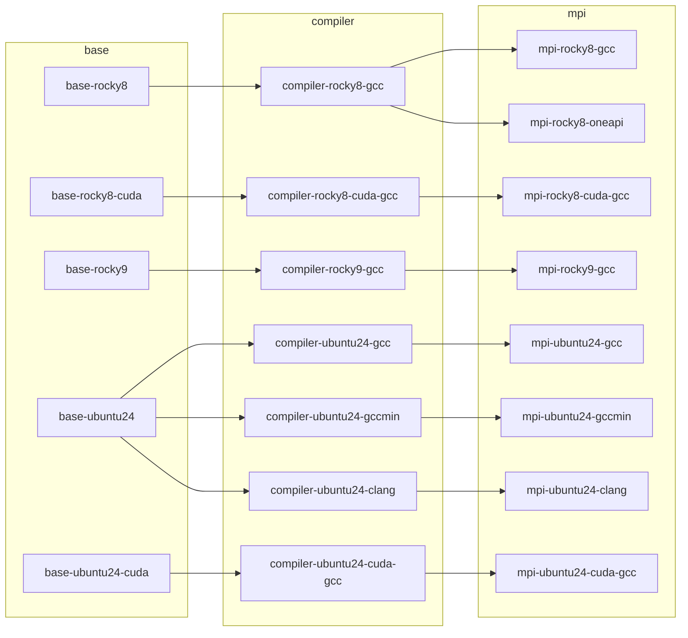

# moose-containers

This repository defines, builds, and publishes the base container images used by
[MOOSE](https://github.com/idaholab/moose) for continuous integration and deployment.

Each image provides a ready-to-use environment: an operating system, a compiler toolchain,
and MPI. MOOSE builds on top of these images, so it never has to set up these
dependencies itself. Every image is defined in this repository with exact, pinned versions.
Images are rebuilt only when one of those versions changes.

All images are published to the GitHub Container Registry (ghcr.io) under
[`ghcr.io/idaholab/moose-containers`](https://github.com/orgs/idaholab/packages?repo_name=moose-containers).

## How it works

Two files control everything that gets built:

- **[`packages.yml`](packages.yml)** lists named software versions, such as operating
  system releases, CUDA, GCC, Clang, MPICH, OpenMPI, and Intel oneAPI. Each entry has a
  name (for example `gcc-ubuntu24`) and a version.
- **[`containers.yml`](containers.yml)** lists every container that gets built. For each
  container it gives the container it builds on (`from`), its Dockerfile (`dockerfile`)
  and the arguments to build it with (`build-args`), the package versions that make up
  its tag (`tags`), a `date`, and whether the image is published as a release
  (`release`). It refers to versions by name from `packages.yml`, for example
  `{{ package("gcc-ubuntu24") }}`, so one version can be shared by many containers.

GitHub Actions reads both files, works out which containers have changed, and builds
only those.

The build workflow has one job per container, so each container waits only for its own
parent. That workflow, [`build.yml`](.github/workflows/build.yml), is generated from
[`.github/templates/build.yml.j2`](.github/templates/build.yml.j2) and `containers.yml`.
After adding, removing or re-parenting a container, regenerate it:

```bash
uv run python .github/scripts/ci.py workflows
```

The pull request build fails if it is out of date.

### Versioning

Each container's tag is made from its parents' versions, its own versions, and its date.
For example, the Ubuntu 24.04 GCC MPI image gets a tag like:

```
ghcr.io/idaholab/moose-containers/moose-mpi-ubuntu24-gcc:24.04-gcc14.2.0-mpich5.0.1-openmpi5.0.11-20260918
                                                         └─OS─┘ └compiler┘ └────────MPI────────┘ └─date─┘
```

**A container is built only when its tag changes.** Editing a Dockerfile or a helper
script does not trigger a build by itself. A container gets rebuilt when you:

- **Change a version in `packages.yml`.** Every container that uses that version gets a
  new tag, and so does every container built on top of it. The change flows down the
  whole dependency tree.
- **Change a container's `date` in `containers.yml`.** Use this to rebuild a container
  when no version changed, for example to pick up a Dockerfile change or OS updates.
  A parent's date is not part of its children's tags, so to rebuild the containers built
  on top of it as well, bump their dates too.

Dates must be real dates (`YYYYMMDD`). They can't be in the future and can't move
backward.

## Containers

The images come in three layers. Each layer builds on the one before it:

1. **base**: an operating system (optionally with NVIDIA CUDA), basic system packages,
   Python, and [ORAS](https://oras.land) for working with registry artifacts.
2. **compiler**: the base plus a compiler toolchain and Valgrind.
3. **mpi**: the compiler image plus MPI libraries (MPICH and/or OpenMPI) built against
   that compiler.



Every image is published under the name `moose-<name>`, for example `moose-mpi-rocky8-gcc`.
Exact versions are in `packages.yml`.

### Released images

These are the release tags defined by the current `containers.yml`. A new tag is published
once the Release workflow runs. This table is generated; don't edit it by hand.

<!-- releases:start -->
| container                                                                                                                                   | tag                                                             |
|---------------------------------------------------------------------------------------------------------------------------------------------|-----------------------------------------------------------------|
| [`moose-base-rocky8`](https://github.com/idaholab/moose-containers/pkgs/container/moose-containers%2Fmoose-base-rocky8)                     | `8.10-20260918`                                                 |
| [`moose-mpi-rocky8-cuda-gcc`](https://github.com/idaholab/moose-containers/pkgs/container/moose-containers%2Fmoose-mpi-rocky8-cuda-gcc)     | `8.10-cuda13.3.1-gcc13.3.1-mpich5.0.1-openmpi5.0.11-20260918`   |
| [`moose-mpi-rocky8-gcc`](https://github.com/idaholab/moose-containers/pkgs/container/moose-containers%2Fmoose-mpi-rocky8-gcc)               | `8.10-gcc13.3.1-mpich5.0.1-openmpi5.0.11-20260918`              |
| [`moose-mpi-rocky8-oneapi`](https://github.com/idaholab/moose-containers/pkgs/container/moose-containers%2Fmoose-mpi-rocky8-oneapi)         | `8.10-gcc13.3.1-oneapi2026.1.1-mpich4.3.2-20260918`             |
| [`moose-mpi-rocky9-gcc`](https://github.com/idaholab/moose-containers/pkgs/container/moose-containers%2Fmoose-mpi-rocky9-gcc)               | `9.7-gcc13.3.1-mpich4.3.2-openmpi5.0.11-20260918`               |
| [`moose-mpi-ubuntu24-clang`](https://github.com/idaholab/moose-containers/pkgs/container/moose-containers%2Fmoose-mpi-ubuntu24-clang)       | `24.04-clang22.1.8-gcc14.2.0-mpich5.0.1-openmpi5.0.11-20260918` |
| [`moose-mpi-ubuntu24-cuda-gcc`](https://github.com/idaholab/moose-containers/pkgs/container/moose-containers%2Fmoose-mpi-ubuntu24-cuda-gcc) | `24.04-cuda13.3.1-gcc14.2.0-mpich5.0.1-openmpi5.0.11-20260918`  |
| [`moose-mpi-ubuntu24-gcc`](https://github.com/idaholab/moose-containers/pkgs/container/moose-containers%2Fmoose-mpi-ubuntu24-gcc)           | `24.04-gcc14.2.0-mpich5.0.1-openmpi5.0.11-20260918`             |
| [`moose-mpi-ubuntu24-gccmin`](https://github.com/idaholab/moose-containers/pkgs/container/moose-containers%2Fmoose-mpi-ubuntu24-gccmin)     | `24.04-gcc9.5.0-mpich5.0.1-20260918`                            |
<!-- releases:end -->

### Base images

| Container | Description |
|---|---|
| `moose-base-rocky8` | Rocky Linux 8, plus [Apptainer](https://apptainer.org) |
| `moose-base-rocky8-cuda` | Rocky Linux 8 with the NVIDIA CUDA toolkit and NCCL |
| `moose-base-rocky9` | Rocky Linux 9 |
| `moose-base-ubuntu24` | Ubuntu 24.04 |
| `moose-base-ubuntu24-cuda` | Ubuntu 24.04 with the NVIDIA CUDA toolkit |

### Compiler images

| Container | Description |
|---|---|
| `moose-compiler-rocky8-gcc` | GCC (gcc-toolset) on Rocky Linux 8 |
| `moose-compiler-rocky8-cuda-gcc` | GCC (gcc-toolset) on Rocky Linux 8 with CUDA |
| `moose-compiler-rocky9-gcc` | GCC (gcc-toolset) on Rocky Linux 9 |
| `moose-compiler-ubuntu24-gcc` | A recent GCC on Ubuntu 24.04 |
| `moose-compiler-ubuntu24-gccmin` | The oldest GCC that MOOSE supports, on Ubuntu 24.04 |
| `moose-compiler-ubuntu24-clang` | LLVM Clang on Ubuntu 24.04, with GCC's gfortran for Fortran |
| `moose-compiler-ubuntu24-cuda-gcc` | GCC on Ubuntu 24.04 with CUDA |

### MPI images

| Container | Description |
|---|---|
| `moose-mpi-rocky8-gcc` | MPICH and OpenMPI built with GCC on Rocky Linux 8 |
| `moose-mpi-rocky8-oneapi` | Intel oneAPI compilers, with MPICH built using them, on Rocky Linux 8 |
| `moose-mpi-rocky8-cuda-gcc` | MPICH (with UCX) and OpenMPI built with GCC on Rocky Linux 8 with CUDA |
| `moose-mpi-rocky9-gcc` | MPICH and OpenMPI built with GCC on Rocky Linux 9 |
| `moose-mpi-ubuntu24-gcc` | MPICH and OpenMPI built with GCC on Ubuntu 24.04 |
| `moose-mpi-ubuntu24-gccmin` | MPICH built with the minimum supported GCC on Ubuntu 24.04 |
| `moose-mpi-ubuntu24-clang` | MPICH and OpenMPI built with Clang on Ubuntu 24.04 |
| `moose-mpi-ubuntu24-cuda-gcc` | MPICH and OpenMPI built with GCC on Ubuntu 24.04 with CUDA |

### Using an image

Every image includes a `/moose_env.sh` script. Each layer adds to it to set up the
environment that layer provides: the compiler on `PATH`, `CC`/`CXX`/`FC`, CUDA, and the
locations of the MPI installs (`MOOSE_MPICH_DIR`, `MOOSE_OPENMPI_DIR`). Source it before
building:

```bash
source /moose_env.sh
```

## From pull request to release

Images go through three stages. Images from the first two stages go to `staging-`
repositories in the registry, so test images never mix with released ones.

| Stage | When | Where the image goes |
|---|---|---|
| **Pull request** | A pull request against `main` is opened or updated | `staging-moose-<name>:pr<N>-<tag>` |
| **Main** | A pull request is merged into `main` | `staging-moose-<name>:main-<tag>` and `:latest` |
| **Release** | A maintainer runs the **Release** workflow | `moose-<name>:<tag>` |

### Pull requests ([`build.yml`](.github/workflows/build.yml))

When a pull request changes `packages.yml` or `containers.yml`, only the affected
containers are built, in dependency order. Unchanged parents are reused from `main`.
The workflow posts a comment on the pull request summarizing:

- which containers will be built, with their old and new tags,
- which package versions changed, and
- which release containers have not been released yet.

At the end, the workflow checks that every container in `containers.yml` exists in the
registry for this pull request or on `main`.

The build cache is kept between runs of the same pull request. To clear it, add the
`ci: delete cache` label to the pull request.

### Main ([`build.yml`](.github/workflows/build.yml))

After a merge, the changed containers are rebuilt and tagged as `main`. These are the
images that release candidates are taken from. If a container's tag didn't change but its
`main` image is missing from the registry, it is rebuilt.

### Release ([`release.yml`](.github/workflows/release.yml))

Releasing is a manual step. A maintainer starts the **Release** workflow from `main`.
By default it runs as a **dry run**, which only reports what would be released. When it
runs for real (this requires approval through the `release` environment), it:

1. merges `main` into the `release` branch, and
2. for each container marked `release: true` that hasn't been released at its current tag,
   copies the existing `main` image to the release location. The image is promoted as it
   is, not rebuilt.

Only the images MOOSE actually uses are marked for release: `moose-base-rocky8` and every
`moose-mpi-*` image. The base and compiler images in between exist to build those.

## Cleanup

The **[Delete images](.github/workflows/delete-images.yml)** workflow keeps the staging
registry from filling up:

- It runs automatically when a pull request is closed, and deletes that pull request's
  images and build cache.
- It can also be run by hand. Choose `all-prs` to delete the images from every pull
  request, or `untagged` to delete untagged image versions left behind in the staging
  repositories. Check **dry_run** to only list what would be deleted.

## Updating a container

1. Change the version in `packages.yml` and/or bump the `date` of the affected containers
   in `containers.yml` (and of any containers built on them that should be rebuilt too).
2. Open a pull request. Check the summary comment to confirm the right containers are
   being rebuilt, and wait for the builds to pass.
3. Merge the pull request. The `main` images are built.
4. Run the **Release** workflow. Do a dry run first, then a real run to publish.
